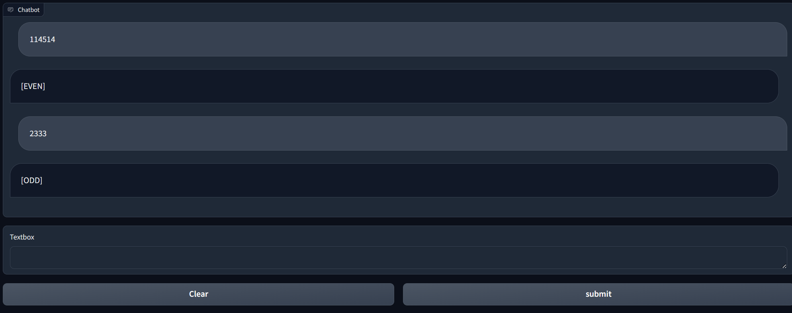

<div align="center">

</div>

<div id="top"></div>  

<div align="center">
  <h3 align="center">JiOu-LLM: 基于llama2的奇偶数判别模型</h3>
</div>


## 环境配置

- `Python` >= 3.8
- `Pytorch` >= 2.0

其他依赖：tqdm（进度条）和gradio（webui）
```bash
pip install tqdm gradio
```

## 推理

### WebUI模式：

<div align="center">

</div>

运行 `webui.py`

### 命令行模式：
运行 `inference.py`

## 训练

运行 `train.py`

## 模型信息

model | Params | Accuracy(0-99999)
|---|---|---
base.pt |13.66M | 99.9997% 

注：本模型将silu激活函数换成[snakebeta](https://arxiv.org/abs/2006.08195)激活函数以更好地捕获周期特征，其余部分与llama2保持一致。

##  TODO

本人对大语言模型了解不多，若有任何疑问或者优化方案，欢迎提issue或pr

- [ ] 训练精度更高的模型

## 参考

[gpt-fast](https://github.com/pytorch-labs/gpt-fast)

[transformers](https://github.com/huggingface/transformers)

[nano-GPT](https://github.com/karpathy/nanoGPT)

[fish-speech](https://github.com/fishaudio/fish-speech)

[gpt-sovits](https://github.com/RVC-Boss/GPT-SoVITS)

[snake](https://github.com/EdwardDixon/snake)

[HierSpeechpp](https://github.com/sh-lee-prml/HierSpeechpp)